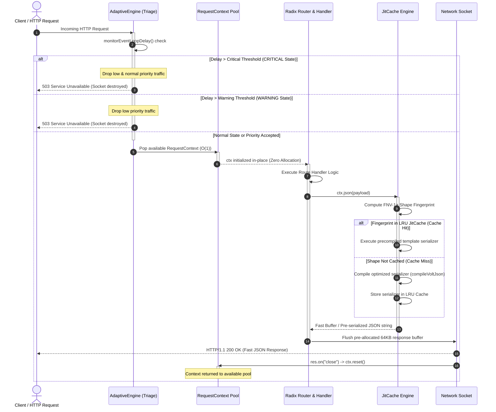

# Performance & Architecture

Volten was engineered from the ground up to minimize latency, eliminate memory allocations, and maximize throughput under extreme concurrency. Its performance advantages stem from three core architectural pillars:

1. **Object Pooling (`RequestPoolSize`)** – Eliminates V8 Garbage Collection (GC) pauses by recycling request and response contexts.
2. **JitCache & Shape Fingerprinting** – Accelerates JSON serialization up to 2-3x faster than standard `JSON.stringify`.
3. **AdaptiveEngine (Traffic Triage)** – Protects critical endpoints from latency spikes via real-time event loop delay monitoring and load shedding.

---

## Architectural Flow

The sequence below illustrates the end-to-end lifecycle of an incoming request traversing the **AdaptiveEngine**, the **Object Pool**, the **Handler pipeline**, and the **JitCache** compilation tier:



---

## 1. Object Pooling

In traditional Node.js web frameworks, every incoming request instantiates several transient JavaScript objects: wrapper request abstractions, response handles, header dictionaries, route parameter holders, and middleware state bags. Under high concurrency (e.g., 50,000+ requests/sec), this creates massive heap churn, triggering frequent V8 Minor GC (Scavenger) and Major GC (Mark-Sweep) pauses that degrade p99 latency.

### Zero-Allocation Context Lifecycle

Volten solves this problem by maintaining pre-allocated object pools for both Node.js (`NodeRequestContext`) and Edge (`EdgeRequestContext`) environments:

```
                      [ Incoming Request ]
                               │
                               ▼
                    [ Pop available context ]
                               │
                ┌──────────────┴──────────────┐
                ▼                             ▼
       (Node.js Runtime)               (Edge Runtime)
       NodeRequestContext            EdgeRequestContext
                │                             │
                ▼                             ▼
        ctx.init(app, ...)           ctx.init(app, ...)
                │                             │
                ▼                             ▼
        [ Execute Handlers ]         [ Execute Handlers ]
                │                             │
                ▼                             ▼
        res.on('close')             Response stream finished
                │                             │
                ▼                             ▼
            ctx.reset()                  ctx.reset()
                │                             │
                └──────────────┬──────────────┘
                               ▼
                   [ Push back to free pool ]
```

### Context Pre-allocation

When you instantiate `new App({ RequestPoolSize: 2048 })`, Volten pre-allocates an array of `RequestPoolSize` reusable `RequestContext` instances:

```typescript
// Internal server initialization (src/core/server.ts)
this.availableContexts = [];
this.availableEdgeContexts = [];
for (let i = 0; i < this.poolSize; i++) {
  this.availableContexts.push(new NodeRequestContext());
  this.availableEdgeContexts.push(new EdgeRequestContext());
}
```

### Fast Reuse with `init()` and `reset()`

- **Acquisition**: Incoming requests pop a pre-allocated instance from `availableContexts` in $O(1)$ time.
- **Initialization**: The context's properties (`method`, `url`, `path`, `queryString`, `headers`, `params`) are populated in-place. No new object wrappers are allocated.
- **Pre-allocated Response Buffers**: Each `RequestContext` carries a pre-allocated 64KB `Buffer` (`RequestContext.BUFFER_SIZE = 64 * 1024`) for ultra-fast static chunk buffering without memory reallocations.
- **Recycling**: When the connection closes (`res.on("close")`), `resetCtx(ctx)` invokes `ctx.reset()`, clearing internal caches (`queryValue`, `params`, `state`, `writeQueue`) and returning the context to `availableContexts`.

### Concurrency Limits & Overload Protection

If traffic spikes exceed the pool capacity (`availableContexts.pop()` returns `undefined`):

- **Node.js**: Responds immediately with `503 Service Unavailable` with `Connection: close`, avoiding memory exhaustion or OOM (Out Of Memory) crash loops.
- **Edge**: Creates a transient context to maintain service continuity.

### Tuning the Pool Size

```typescript
import { App } from "volten";

const app = new App({
  // Increase pool size for high-throughput bare-metal or container environments
  RequestPoolSize: 4096,
});
```

---

## 2. JitCache & Shape-Based JSON Serialization

JSON serialization is typically one of the heaviest CPU bottlenecks in backend web servers. Standard `JSON.stringify` uses generic reflection, checking data types, object keys, and string escapes dynamically on every call.

Volten includes a built-in JIT compilation and shape-caching engine (`JitCache`) that compiles specialized, highly optimized stringifier functions for specific object structures.

### How Shape Fingerprinting Works

Rather than serializing blindly, Volten analyzes the structural "shape" of an object using `JitCache.prototype.getShapeFingerprint(obj)`:

1. **Non-Recursive Stack Traversal**: It traverses object keys and value types using an internal static stack array without recursive function call overhead.
2. **FNV-1a 32-bit Integer Hashing**: Multiplies character codes and type identifiers using `Math.imul` to compute a unique 32-bit integer fingerprint for the object's layout:
   - Objects, arrays, numbers, strings, booleans, dates, bigints, and nulls each have designated prime multipliers.
3. **WeakMap Memoization**: Once an object instance is fingerprinted, the result is cached in a `WeakMap<object, number>` for sub-microsecond retrieval.

### JIT Code Generation (`compileVoltJson`)

When an endpoint repeatedly responds with the same data shape, Volten compiles a specialized JavaScript template literal function:

```javascript
// Generated JIT serializer code representation:
function serializer(d) {
  if (!d) return "null";
  return `{"id":${d.id},"name":"${d.name.replaceAll('"', '\\"')},"active":${d.active}}`;
}
```

This bypasses `JSON.stringify` reflection entirely, reading properties directly via V8 hidden classes.

### LRU Eviction & Stability Tracking

- **LRU Caching**: `JitCache` holds up to `maxCapacity` entries (default: `2000`). If diverse shapes fill the cache, the least-recently-used compiled serializers are automatically evicted.
- **Stability Counters**: The cache tracks `stableCount` for each fingerprint to identify consistent shapes vs. polymorphic or dynamic payloads.

> [!NOTE]
> In Edge runtimes where dynamic code generation via `new Function` is restricted (e.g. Cloudflare Workers), Volten automatically detects the environment via `isEdge()` and safely falls back to native `JSON.stringify`.

---

## 3. AdaptiveEngine (Adaptive Traffic Triage)

High CPU utilization or unexpected synchronous operations (e.g., regex backtracking, massive JSON parsing, cryptography) can block the Node.js event loop. When the event loop lags, request queues fill up, latency compounds exponentially, and all users experience timeouts.

Volten's **AdaptiveEngine** provides automatic, intelligent load shedding to protect critical endpoints during severe traffic spikes.

### Event Loop Latency Sensor

`AdaptiveEngine` leverages Node's native `perf_hooks.monitorEventLoopDelay` API. It samples event loop latency with sub-millisecond precision without adding CPU overhead:

```typescript
import { App } from "volten";

const app = new App({
  adaptiveTriage: {
    enabled: true,
    warningThresholdMs: 40, // Milliseconds of lag to enter WARNING
    criticalThresholdMs: 100, // Milliseconds of lag to enter CRITICAL
    resolutionMs: 10, // Sampling resolution
    checkIntervalMs: 500, // Background evaluation tick (ms)
  },
});
```

### Three-Tier Triage States

The engine evaluates server health into three distinct states:

| State      | Condition                                   | Impact on Traffic                                                                                  |
| :--------- | :------------------------------------------ | :------------------------------------------------------------------------------------------------- |
| `NORMAL`   | Event loop delay $\le$ `warningThresholdMs` | All incoming requests are processed normally.                                                      |
| `WARNING`  | Event loop delay $>$ `warningThresholdMs`   | Requests with **`low`** priority are shed immediately (`503 Service Unavailable`).                 |
| `CRITICAL` | Event loop delay $>$ `criticalThresholdMs`  | Requests with **`low`** and **`normal`** priority are shed. Only **`critical`** endpoints survive. |

### Micro-Evaluations

In addition to periodic background interval ticks, `AdaptiveEngine.evaluateState()` executes instantly on incoming requests (`onRequest` and `createFetch`). If a sudden synchronous block occurs, the server responds immediately without waiting for the next timer interval.

### Tagging Route Priorities

You can assign a `priority` to each route using route options:

```typescript
import { App } from "volten";

const app = new App({
  adaptiveTriage: { enabled: true, warningThresholdMs: 20, criticalThresholdMs: 50 },
});

// 1. CRITICAL VIP ROUTE: Always processes, even under 99% CPU load
app.post("/api/checkout", { priority: "critical" }, async (ctx) => {
  ctx.json({ success: true, message: "Payment processed!" });
});

// 2. NORMAL ROUTE (Default): Standard business logic
app.get("/api/users/:id", { priority: "normal" }, async (ctx) => {
  ctx.json({ id: ctx.params.id, name: "Alice" });
});

// 3. LOW PRIORITY ROUTE: Shed first when the event loop lags
app.get("/api/analytics/export", { priority: "low" }, async (ctx) => {
  ctx.json({ message: "Heavy analytics computation" });
});

app.listen(3000);
```

### Dropped Request Behavior

When a route is shed by `AdaptiveEngine`, Volten bypasses routing and middleware execution, returning:

- **HTTP Status**: `503 Service Unavailable`
- **Body**: `503 Service Unavailable: Server at capacity`
- **Socket**: Immediately closed (`res.destroy()` / `req.socket.destroy()`) to protect server network buffers.

---

## Graceful Server Shutdown

Volten's object pool enables fully safe, drain-aware graceful shutdown:

```typescript
await app.close();
```

When `app.close()` is invoked:

1. `acceptIncomming` is set to `false`, immediately refusing new connections.
2. `adaptiveEngine.close()` terminates event loop delay monitoring timers.
3. The server polls `availableContexts` and waits up to 10 seconds for all in-flight requests to finish and return to the pool.
4. The underlying HTTP/HTTPS server closes cleanly.
