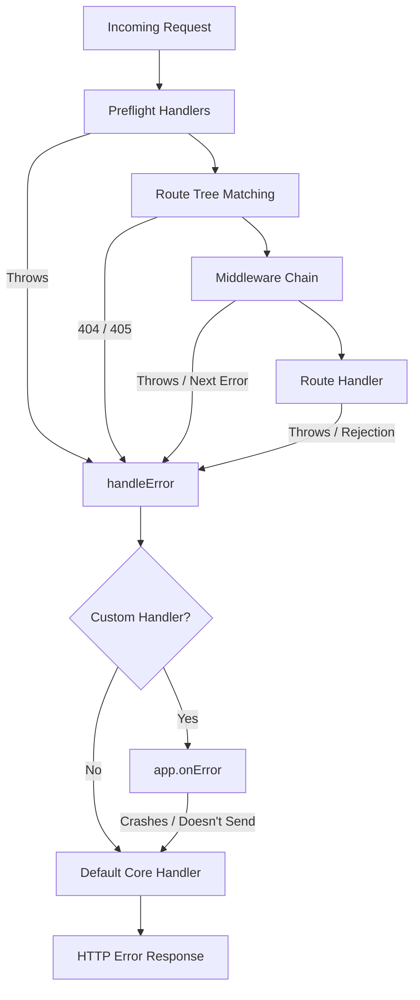

# The Error Pipeline

In Volten, you never have to worry about an unhandled asynchronous error taking down your server. The execution lifecycle is wrapped with safety boundaries:

1. **Synchronous & Asynchronous Trapping**: Any error thrown synchronously or rejected asynchronously in a route handler or middleware is caught automatically.
2. **Double-Response & Header Guards**: Calling `next()` repeatedly or attempting to modify headers after a response has ended triggers dedicated framework errors rather than silently corrupting sockets.
3. **Graceful Fallbacks**: If a custom error handler throws an exception or fails to terminate the response, Volten activates a safe fallback to guarantee clients receive an appropriate HTTP response.

---
