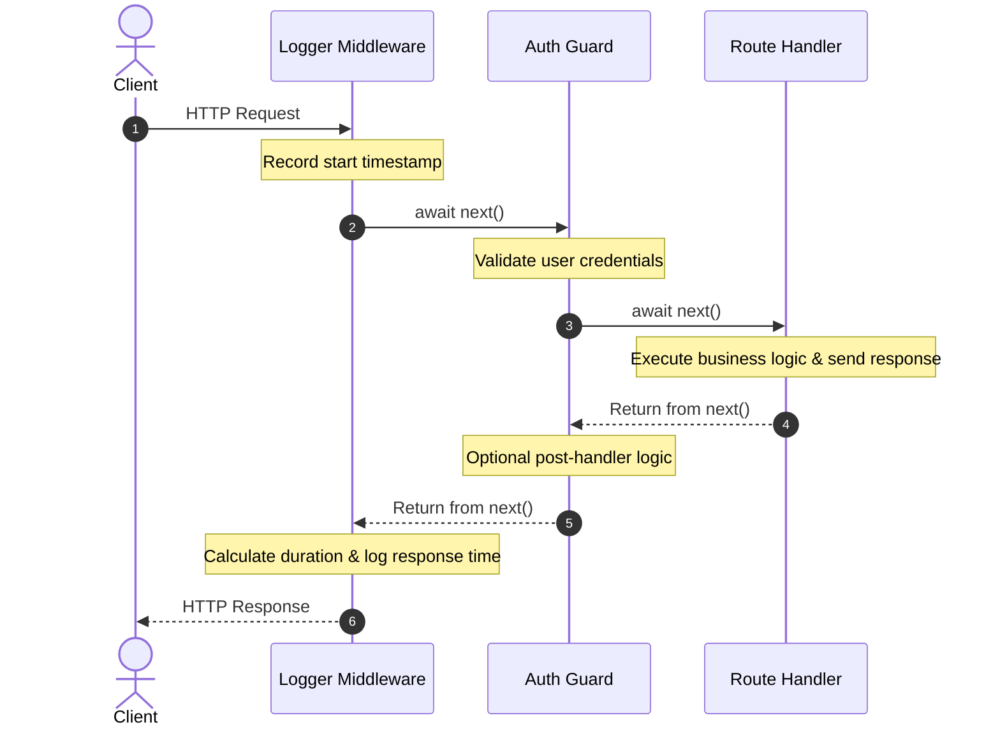

# The Onion Execution Model

Middleware in Volten executes in a cascading "onion" flow:

1. **Downstream Phase**: Middlewares execute from outer to inner in the order they were registered.
2. **Terminal Handler**: The route handler processes the request and prepares the response.
3. **Upstream Phase**: Once `await next()` resolves, control flows back in reverse order (from inner to outer), allowing earlier middlewares to inspect or finalize the response.



### Timing Requests Example

```typescript
import { App } from 'volten';

const app = new App();

app.use(async (ctx, next) => {
  const start = Date.now();

  // Wait for all downstream middlewares and the route handler to finish
  await next();

  // Runs on the return trip
  const duration = Date.now() - start;
  ctx.setHeader('X-Response-Time', `${duration}ms`);
  console.log(`${ctx.method} ${ctx.url} - ${ctx.statusCode} (${duration}ms)`);
});
```

---